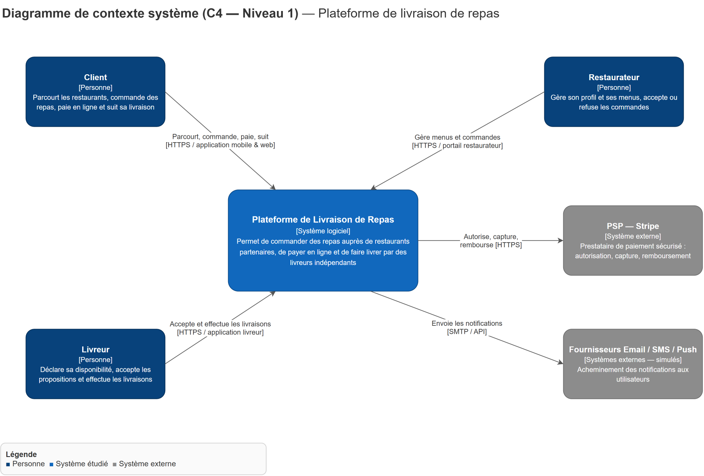
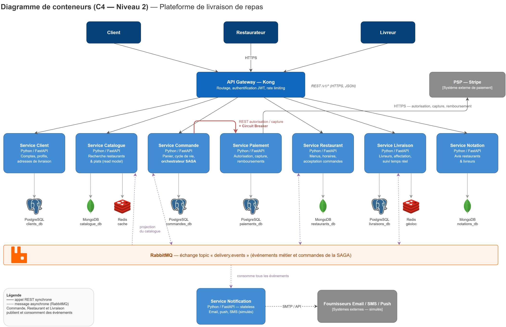

# 1. Description générale de l'architecture proposée

## 1.1 Objectif du système

La plateforme met en relation trois types d'acteurs :

- **Clients** : parcourent les restaurants, commandent des repas, paient en ligne et suivent leur livraison en temps réel ;
- **Restaurateurs** : gèrent leur profil, leurs menus et leurs horaires, acceptent ou refusent les commandes ;
- **Livreurs indépendants** : déclarent leur disponibilité, acceptent des propositions de livraison et les effectuent.

Le système s'appuie sur deux catégories de systèmes externes : un **prestataire de paiement (PSP, ex. Stripe)** pour l'autorisation, la capture et le remboursement des paiements, et des **fournisseurs de notification** (email, SMS, push — simulés dans le cadre du projet).

## 1.2 Style architectural retenu

Nous avons retenu une **architecture microservices orientée domaine (DDD)**, composée de **8 microservices** derrière un **API Gateway**, communiquant :

- en **REST synchrone** pour les interactions requête/réponse qui exigent une réponse immédiate (lectures, autorisation de paiement) ;
- par **événements asynchrones via RabbitMQ** pour les processus métier longs et la propagation d'état entre services (acceptation restaurant, livraison, notifications, projection du catalogue).

### Vue d'ensemble des composants

| Composant | Rôle | Technologie |
|-----------|------|-------------|
| API Gateway | Point d'entrée unique : routage, authentification JWT, rate limiting | Kong |
| Service Client | Comptes, profils, adresses | FastAPI + PostgreSQL |
| Service Catalogue | Recherche restaurants/plats (read model dénormalisé) | FastAPI + MongoDB + Redis |
| Service Commande | Panier, cycle de vie des commandes, **orchestrateur SAGA** | FastAPI + PostgreSQL |
| Service Paiement | Autorisation, capture, remboursement (intégration PSP) | FastAPI + PostgreSQL |
| Service Restaurant | Profils, menus, horaires, acceptation des commandes | FastAPI + MongoDB |
| Service Livraison | Gestion des livreurs, affectation, suivi temps réel | FastAPI + PostgreSQL + Redis |
| Service Notation | Avis clients → restaurants et livreurs | FastAPI + MongoDB |
| Service Notification | Email / push / SMS simulés (stateless) | FastAPI |
| Broker de messages | Échange topic `delivery.events` | RabbitMQ |

## 1.3 Principes directeurs

1. **Un bounded context = un microservice** : chaque service possède un vocabulaire, une équipe potentielle et un cycle de déploiement propres (voir [analyse du domaine](02-analyse-domaine.md)).
2. **Database per service** : aucune base partagée ; chaque service est seul propriétaire de son schéma ([ADR-002](adr/ADR-002-database-per-service-polyglotte.md)).
3. **Cohérence à terme assumée** : les invariants inter-services sont garantis par une [SAGA orchestrée](06-coherence-saga.md) et le pattern Transactional Outbox, pas par des transactions distribuées (2PC).
4. **Résilience by design** : timeouts systématiques, retries avec backoff et [Circuit Breaker](07-resilience.md) sur les appels synchrones critiques ; les échecs partiels sont des cas nominaux.
5. **Contrats d'API explicites et versionnés** : chaque service expose un contrat [OpenAPI 3](05-contrats-api.md) versionné par le chemin (`/v1/...`).

## 1.4 Stack technique

- **Langage / framework** : Python 3.12 + FastAPI (OpenAPI généré nativement, rapidité de mise en œuvre pour un prototype) ;
- **Bases de données** : PostgreSQL (données transactionnelles), MongoDB (documents flexibles : menus, avis, read model), Redis (cache et géolocalisation temps réel) ;
- **Broker** : RabbitMQ (échange de type topic) ;
- **API Gateway** : Kong ;
- **Conteneurisation** : Docker + Docker Compose (un conteneur par service + infrastructures).

## 1.5 Déploiement (cible du prototype)

Le `docker-compose.yml` du prototype lancera : les services mockés (au minimum Commande, Paiement, Restaurant), RabbitMQ, l'API Gateway et les bases nécessaires. Chaque service est buildé depuis son propre Dockerfile et exposé uniquement via le gateway ; seuls RabbitMQ Management et la documentation Swagger de chaque service restent accessibles en direct pour la démonstration.
