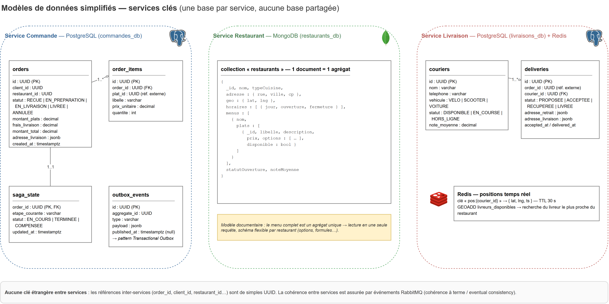

# 3. Description des microservices

Chaque service suit le principe **database per service** : il est l'unique propriétaire de ses données ; les autres services n'y accèdent que via son API ou ses événements. Les modèles de données détaillés des trois services clés sont illustrés ci-dessous.

---

## 3.1 Service Client

| | |
|---|---|
| **Responsabilités** | Inscription, authentification (émission de JWT), profil, adresses de livraison, consultation de l'historique de commandes (par appel au service Commande) |
| **Base de données** | PostgreSQL `clients_db` |
| **Expose** | REST `/v1/clients`, `/v1/auth` |
| **Publie** | `client.cree`, `client.modifie` |

**Modèle principal** : `clients` (id UUID, email unique, hash mot de passe, nom, téléphone), `adresses` (id, client_id FK, libellé, rue, ville, code postal, géolocalisation, par défaut O/N).

## 3.2 Service Restaurant

| | |
|---|---|
| **Responsabilités** | Profil restaurant, menus/plats/options, horaires d'ouverture, **acceptation ou refus des commandes**, suivi des commandes en préparation |
| **Base de données** | MongoDB `restaurants_db` — le menu complet est un **agrégat documentaire unique** (lecture en une requête, schéma flexible par restaurant) |
| **Expose** | REST `/v1/restaurants`, `/v1/restaurants/{id}/menus`, `/v1/restaurants/{id}/commandes` |
| **Consomme** | `restaurant.acceptation.demandee` (étape de la SAGA) |
| **Publie** | `order.acceptee`, `order.refusee`, `order.prete`, `menu.mis-a-jour` |

**Modèle principal** : collection `restaurants` — document contenant identité, adresse + géolocalisation, type de cuisine, horaires, et `menus[] → plats[]` (libellé, description, prix, options, disponibilité).

## 3.3 Service Catalogue

| | |
|---|---|
| **Responsabilités** | Recherche de restaurants par localisation / type de cuisine, recherche de plats, affichage des menus — **read model dénormalisé** (CQRS léger) |
| **Base de données** | MongoDB `catalogue_db` (index géospatial + texte) et cache Redis (résultats chauds, TTL 60 s) |
| **Expose** | REST `/v1/catalogue/restaurants?lat=&lng=&cuisine=&q=` |
| **Consomme** | `menu.mis-a-jour`, `restaurant.ouvert/ferme` (projection) |

Le catalogue peut être **entièrement reconstruit** à partir des événements du service Restaurant : la perte de sa base n'est pas critique.

## 3.4 Service Commande — cœur du système

| | |
|---|---|
| **Responsabilités** | Panier, création de commande, calcul du prix total (plats + frais de livraison), gestion du cycle de vie (`RECUE → EN_PREPARATION → EN_LIVRAISON → LIVREE / ANNULEE`), **orchestration de la SAGA** de passage de commande |
| **Base de données** | PostgreSQL `commandes_db` |
| **Expose** | REST `/v1/commandes` (voir [contrat OpenAPI](api/commande-service.openapi.yaml)) |
| **Appelle (sync)** | Service Paiement (autorisation, capture, remboursement) — protégé par circuit breaker |
| **Publie / consomme** | Commandes et événements de la SAGA (voir [06-coherence-saga.md](06-coherence-saga.md)) |

**Modèle principal** : `orders`, `order_items` (lignes figées : libellé et prix copiés au moment de l'achat), `saga_state` (étape courante et statut de chaque SAGA) et `outbox_events` (pattern **Transactional Outbox** : l'événement est écrit dans la même transaction que l'état, puis publié vers RabbitMQ par un relai).

## 3.5 Service Paiement

| | |
|---|---|
| **Responsabilités** | Façade vers le PSP externe (Stripe simulé) : **autorisation** à la commande, **capture** à la livraison, **remboursement total ou partiel** en compensation |
| **Base de données** | PostgreSQL `paiements_db` |
| **Expose** | REST interne `/v1/paiements` (non exposé via le gateway ; consommé uniquement par le service Commande) |
| **Publie** | `paiement.autorise`, `paiement.capture`, `paiement.rembourse`, `paiement.refuse` |

**Modèle principal** : `paiements` (id, order_id, montant, statut `AUTORISE / CAPTURE / REMBOURSE / REFUSE`, référence PSP, horodatages). Les données de carte **ne transitent jamais** par notre système (tokenisation côté PSP).

## 3.6 Service Livraison

| | |
|---|---|
| **Responsabilités** | Gestion des livreurs (profil, disponibilité), **affectation du livreur le plus proche** à une commande prête, suivi de livraison en temps réel, confirmation de remise |
| **Base de données** | PostgreSQL `livraisons_db` + Redis (positions temps réel `pos:{courier_id}` avec TTL 30 s, index `GEOADD` pour la recherche de proximité) |
| **Expose** | REST `/v1/livreurs` (app livreur), `/v1/livraisons/{id}/suivi` (client) |
| **Consomme** | `livraison.demandee` (étape SAGA) |
| **Publie** | `livraison.affectee`, `livraison.recuperee`, `livraison.terminee`, `livraison.echec` |

**Modèle principal** : `couriers` (statut `DISPONIBLE / EN_COURSE / HORS_LIGNE`, véhicule, note moyenne), `deliveries` (order_id en référence externe, courier_id, statut, adresses de retrait/livraison, horodatages).

## 3.7 Service Notation

| | |
|---|---|
| **Responsabilités** | Dépôt et consultation d'avis : client → restaurant et client → livreur ; calcul des moyennes |
| **Base de données** | MongoDB `notations_db` |
| **Expose** | REST `/v1/notations` |
| **Consomme** | `order.livree` (autorise la notation d'une commande réellement livrée) |
| **Publie** | `notation.deposee` (permet aux services Restaurant/Livraison de mettre à jour leur note moyenne) |

**Modèle principal** : collection `avis` (order_id, auteur, cible restaurant|livreur, note 1–5, commentaire, date). Un avis n'est accepté que si la commande est passée à l'état LIVREE (règle vérifiée par projection locale des événements).

## 3.8 Service Notification

| | |
|---|---|
| **Responsabilités** | Envoi des notifications aux clients, restaurateurs et livreurs sur trois canaux : email, push (simulé), SMS (simulé) |
| **Base de données** | Aucune (stateless) — journalisation console/logs pour la démo |
| **Consomme** | Tous les événements métier pertinents (`order.*`, `livraison.*`, `paiement.*`) via une file dédiée sur l'échange topic |

Service purement réactif : ajouter un canal ou un destinataire ne modifie aucun autre service.

---

## Récapitulatif

| Service | BDD | Sync (expose) | Async (publie) | Async (consomme) |
|---------|-----|----------------|----------------|------------------|
| Client | PostgreSQL | /v1/clients, /v1/auth | client.* | — |
| Restaurant | MongoDB | /v1/restaurants | order.acceptee/refusee/prete, menu.* | restaurant.acceptation.demandee |
| Catalogue | MongoDB + Redis | /v1/catalogue | — | menu.*, restaurant.* |
| Commande | PostgreSQL | /v1/commandes | order.*, cmds SAGA | order.*, livraison.*, paiement.* |
| Paiement | PostgreSQL | /v1/paiements (interne) | paiement.* | — |
| Livraison | PostgreSQL + Redis | /v1/livreurs, /v1/livraisons | livraison.* | livraison.demandee |
| Notation | MongoDB | /v1/notations | notation.deposee | order.livree |
| Notification | — | — | — | tous les événements |
