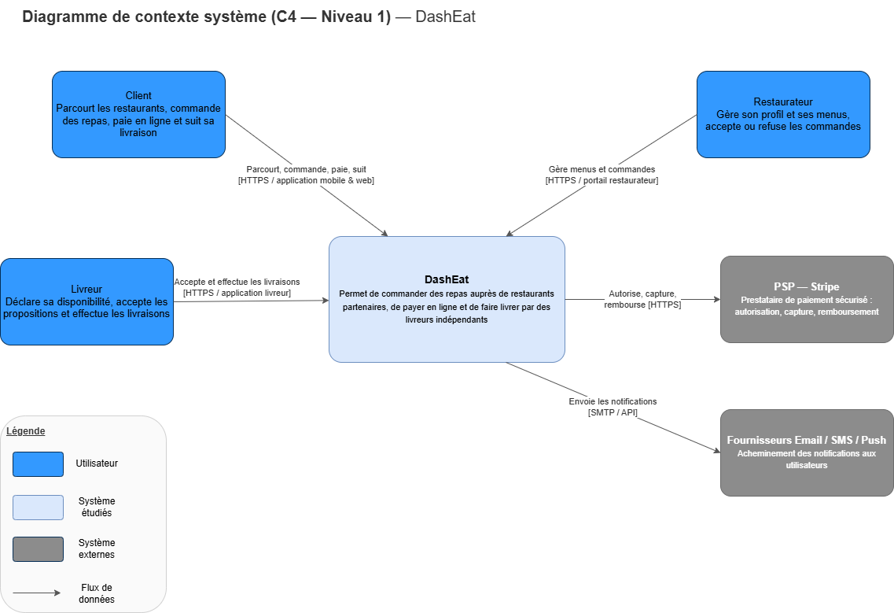
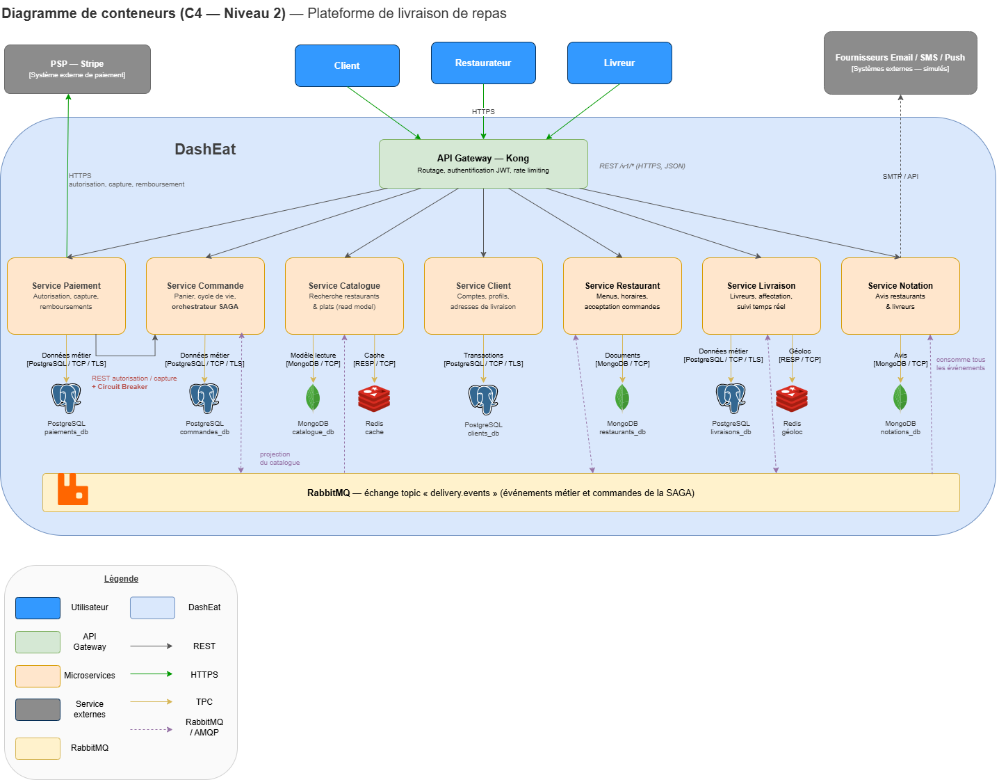

# 1. Description générale de l'architecture proposée

## 1.1 Objectif du système

**DashEat** est une plateforme de livraison de repas qui met en relation trois types d'acteurs :

- **Clients** : parcourent les restaurants, commandent des repas, paient en ligne et suivent leur livraison en temps réel ;
- **Restaurateurs** : gèrent leur profil, leurs menus et leurs horaires, acceptent ou refusent les commandes ;
- **Livreurs indépendants** : déclarent leur disponibilité, acceptent des propositions de livraison et les effectuent.



Le système s'appuie sur deux catégories de systèmes externes : un **prestataire de paiement (PSP, ex. Stripe)** pour l'autorisation, la capture et le remboursement des paiements, et des **fournisseurs de notification** (email, SMS, push — simulés dans le cadre du projet).

## 1.2 Style architectural retenu

Nous avons retenu une **architecture microservices orientée domaine (DDD)**, composée de **10 microservices** derrière un **API Gateway**, communiquant :

- en **REST synchrone** pour les interactions requête/réponse qui exigent une réponse immédiate (lectures, autorisation de paiement) ;
- par **événements asynchrones via RabbitMQ** pour les processus métier longs et la propagation d'état entre services (acceptation restaurant, livraison, notifications, projection du catalogue).



### Vue d'ensemble des composants

| Composant            | Rôle                                                                                    | Technologie                   |
|----------------------|-----------------------------------------------------------------------------------------|-------------------------------|
| API Gateway          | Point d'entrée unique : routage piloté par les contrats OpenAPI, agrégation, Swagger UI | Flask                         |
| Service Client       | Comptes, profils, adresses, authentification JWT                                        | Flask + MongoDB               |
| Service Catalogue    | Recherche restaurants/plats (read model dénormalisé)                                    | Flask + Elasticsearch + Redis |
| Service Commande     | Panier, cycle de vie des commandes, **orchestrateur SAGA**                              | Flask + PostgreSQL            |
| Service Paiement     | Traitement des paiements et remboursements (PSP simulé)                                 | Flask + PostgreSQL            |
| Service Restaurant   | Profils, menus, horaires, acceptation des commandes                                     | Flask + PostgreSQL            |
| Service Livraison    | Création et suivi des courses                                                           | Flask + MongoDB               |
| Service Livreur      | Flotte de livreurs : disponibilité, affectation, libération                             | Flask + MongoDB               |
| Service Notation     | Avis clients → restaurants et livreurs                                                  | Flask + MongoDB               |
| Service Notification | Email / push / SMS simulés (lecture seule HTTP, piloté par événements)                  | Flask + PostgreSQL            |
| Broker de messages   | Échanges topic par service (`order.events`, `payment.events`…)                          | RabbitMQ                      |

L'affectation des moteurs de persistance est justifiée dans l'[ADR-007](adr/ADR-007-choix-moteurs-persistance.md).

## 1.3 Principes directeurs

1. **Un bounded context = un microservice** : chaque service possède un vocabulaire, une équipe potentielle et un cycle de déploiement propres (voir [analyse du domaine](02-analyse-domaine.md)).
2. **Database per service** : aucune base partagée ; chaque service est seul propriétaire de son schéma ([ADR-002](adr/ADR-002-database-per-service-polyglotte.md)).
3. **Cohérence à terme assumée** : les invariants inter-services sont garantis par une [SAGA orchestrée](06-coherence-saga.md) et le pattern Transactional Outbox, pas par des transactions distribuées (2PC).
4. **Résilience by design** : timeouts systématiques, retries avec backoff et [Circuit Breaker](07-resilience.md) sur les appels synchrones critiques ; les échecs partiels sont des cas nominaux.
5. **Contrats d'API explicites** : chaque service expose un contrat [OpenAPI 3](05-contrats-api.md) chargé à l'exécution — il valide les requêtes entrantes et pilote la table de routage du gateway.
6. **Clean Architecture dans chaque service** : le domaine ne dépend d'aucun framework ni d'aucune infrastructure (voir 1.4).

## 1.4 Architecture interne des services : Clean Architecture

Chaque microservice applique la **Clean Architecture** : le code est organisé en quatre couches concentriques, avec une règle de dépendance stricte — les dépendances pointent toujours vers l'intérieur, jamais l'inverse.

```
services/main/<service>/
  domain/            # Entités, valeurs, règles métier, exceptions typées — aucune dépendance externe
  application/       # Cas d'utilisation (<service>_service.py) — orchestre le domaine via des abstractions
  infrastructure/    # Adaptateurs sortants : repositories (in-memory, MongoDB), clients HTTP, broker
  interfaces/
    http/            # Adaptateurs entrants REST : routes Flask (Blueprints) et serializers
    events/          # Adaptateurs entrants asynchrones : handlers d'événements RabbitMQ
  config.py          # Configuration par variables d'environnement
  app.py             # Factory : instancie et câble les couches (injection de dépendances manuelle)
```

- **`domain/`** ne connaît ni Flask, ni pika, ni aucun driver de base : les entités sont des dataclasses pures et les règles métier lèvent des exceptions typées (`OrderException`, `PaymentDeclined`…) portant leur code et leur statut HTTP.
- **`application/`** implémente les cas d'utilisation en ne manipulant que le domaine et des abstractions (repository, broker, clients) reçues par injection dans le constructeur.
- **`infrastructure/`** fournit les implémentations concrètes : c'est la seule couche à changer quand on passe d'un repository in-memory à MongoDB (`MongoDBCustomerRepository`, `MongoDBDelivererRepository`) — le domaine et les cas d'utilisation restent intacts ([ADR-007](adr/ADR-007-choix-moteurs-persistance.md), « État du prototype »).
- **`interfaces/`** traduit le monde extérieur vers l'application : les routes HTTP désérialisent, appellent le service applicatif et mappent les exceptions du domaine vers l'enveloppe d'erreur uniforme ; les handlers d'événements font de même côté asynchrone.
- **`app.py`** est la *composition root* : la factory `create_app()` construit les adaptateurs, les injecte dans le service applicatif et enregistre les Blueprints — ainsi que la validation OpenAPI ([chapitre 5](05-contrats-api.md)), qui reste un middleware d'interface sans impact sur le domaine.

Bénéfices concrets constatés sur le projet : les suites de tests unitaires testent le domaine et l'application sans démarrer Flask ni RabbitMQ ; la migration in-memory → MongoDB de deux services s'est faite sans toucher une ligne de domaine ; la validation par contrat s'est branchée uniformément sur les dix services via la factory.

## 1.5 Stack technique

- **Langage / framework** : Python 3.10 + Flask 3.0 (Blueprints par service, factory `create_app()`) ;
- **Bases de données** : PostgreSQL (données transactionnelles), MongoDB (documents : comptes, livreurs, courses, avis), Elasticsearch (recherche du catalogue), Redis (cache) — affectation justifiée dans l'[ADR-007](adr/ADR-007-choix-moteurs-persistance.md) ;
- **Broker** : RabbitMQ (échanges de type topic) ;
- **API Gateway** : reverse-proxy Flask maison, routage construit depuis les contrats OpenAPI ;
- **Contrats d'API** : OpenAPI 3.0.3 par service, validation runtime (PyYAML + jsonschema) ;
- **Conteneurisation** : Docker + Docker Compose (un conteneur par service + infrastructures).

## 1.6 Déploiement (prototype)

Le `docker-compose.yml` lance les 10 microservices, RabbitMQ, Redis et les bases de données par service (PostgreSQL, MongoDB, Elasticsearch). Chaque service est buildé depuis son propre Dockerfile (utilisateur non-root, healthcheck) ; la documentation Swagger agrégée de la plateforme est servie par le gateway sur `/docs`, et RabbitMQ Management reste accessible en direct pour la démonstration.
