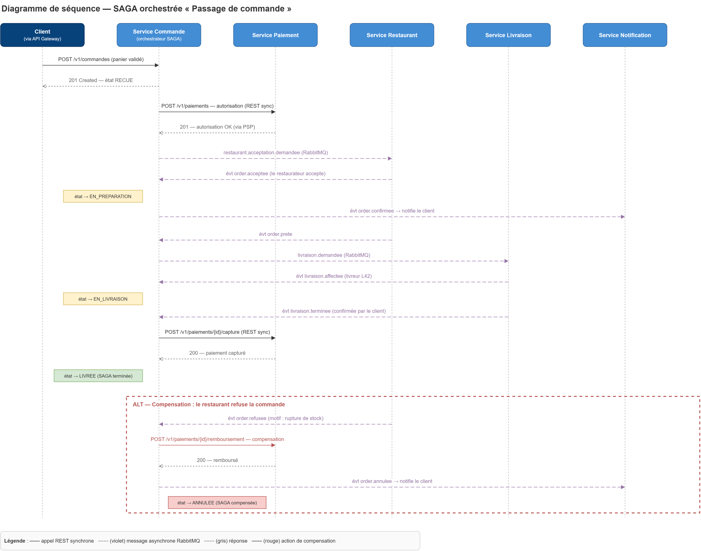

# 6. Gestion de la cohérence et SAGA « Passage de commande »

## 6.1 Stratégie générale de cohérence

Avec une base par service ([ADR-002](adr/ADR-002-database-per-service-polyglotte.md)), les transactions ACID ne peuvent porter que sur les données **d'un seul** service. Nous refusons les transactions distribuées (2PC/XA) — bloquantes, fragiles et non supportées par nos briques — au profit de la **cohérence à terme (eventual consistency)** :

- **À l'intérieur d'un service** : transactions ACID classiques (PostgreSQL) sur l'agrégat.
- **Entre services** : propagation par **événements** (RabbitMQ) avec le pattern **Transactional Outbox** pour garantir qu'un changement d'état et son événement sont émis atomiquement.
- **Pour les processus métier multi-services** : pattern **SAGA** — suite de transactions locales, chacune compensable en cas d'échec d'une étape ultérieure.
- **Idempotence** partout : livraison at-least-once ⇒ tout consommateur doit tolérer les doublons (déduplication par `message_id`).

Conséquence assumée : une lecture peut être momentanément en retard (ex. le catalogue reflète un menu avec quelques secondes de décalage). Aucun invariant critique ne repose sur ces lectures.

## 6.2 Processus critique retenu : le passage de commande

Le passage de commande traverse **quatre services** et deux systèmes externes :

> créer la commande → autoriser le paiement → faire accepter par le restaurant → affecter un livreur → livrer → capturer le paiement

Chaque étape peut échouer (paiement refusé, restaurant fermé/rupture de stock, aucun livreur disponible). Il faut donc pouvoir **défaire** les étapes déjà réalisées : c'est le cas d'école d'une SAGA.

## 6.3 Choix : SAGA orchestrée

Nous avons retenu l'**orchestration** ([ADR-004](adr/ADR-004-saga-orchestration.md)) : le **service Commande** contient l'orchestrateur, qui pilote chaque étape et centralise l'état d'avancement (`saga_state`).

Justification face à la chorégraphie :

- le processus est **séquentiel avec branchements** (5 étapes, 3 scénarios de compensation) : en chorégraphie, la logique serait éparpillée dans 4 services et difficile à suivre ;
- l'orchestrateur offre un **point d'observation unique** (précieux pour le débogage et la démo) ;
- l'ajout d'une étape ne modifie qu'un seul endroit ;
- le couplage introduit reste faible : l'orchestrateur n'appelle les participants que par messages/API publics, et les participants ne connaissent pas la SAGA.

Mécanique retenue : étapes **synchrones** vers Paiement (résultat immédiat requis, protégé par circuit breaker) et **asynchrones** vers Restaurant et Livraison (délais humains) — voir [04-communication.md](04-communication.md).

## 6.4 Déroulement nominal et compensations



### Étapes (transactions locales)

| # | Étape                  | Service    | Transaction locale                             | Compensation associée                     |
|---|------------------------|------------|------------------------------------------------|-------------------------------------------|
| 1 | Création commande      | Commande   | `orders` : état RECUE                          | Marquer ANNULEE                           |
| 2 | Autorisation paiement  | Paiement   | Autorisation PSP (fonds réservés, non débités) | Annulation d'autorisation / remboursement |
| 3 | Acceptation restaurant | Restaurant | Ticket accepté, préparation lancée             | Événement d'annulation du ticket          |
| 4 | Affectation livreur    | Livraison  | `deliveries` créée, livreur réservé            | Libérer le livreur, annuler la course     |
| 5 | Livraison confirmée    | Livraison  | Livraison LIVREE                               | — (fin de parcours)                       |
| 6 | Capture du paiement    | Paiement   | Débit effectif                                 | (remboursement si litige — hors SAGA)     |

**Point de non-retour (pivot)** : l'acceptation par le restaurant. Avant le pivot, toute défaillance annule la commande sans impact client (l'autorisation est simplement libérée). Après le pivot (plats en préparation), les compensations deviennent des décisions métier : si aucun livreur n'est trouvé, la plateforme rembourse le client (elle assume le coût du repas préparé).

### Scénarios de compensation

1. **Paiement refusé (étape 2)** → commande ANNULEE, notification client. Aucune compensation nécessaire (rien d'autre n'a eu lieu).
2. **Restaurant refuse ou timeout d'acceptation de 5 min (étape 3)** → l'orchestrateur exécute `POST /v1/paiements/{id}/remboursement` (compensation de l'étape 2) puis marque la commande ANNULEE et notifie le client. **C'est le scénario illustré dans le diagramme ci-dessus.**
3. **Aucun livreur disponible après 10 min (étape 4)** → remboursement + annulation + notifications (client et restaurant).

### Gestion des cas dégradés

- **Timeouts de SAGA** : chaque étape asynchrone a une échéance (stockée dans `saga_state`) ; un scheduler interne déclenche la compensation si l'échéance expire sans réponse.
- **Compensation qui échoue** (ex. Paiement injoignable au moment du remboursement) : la compensation est **réessayée indéfiniment avec backoff** (elle est idempotente) ; au-delà d'un seuil, alerte pour intervention manuelle. Une compensation n'est jamais abandonnée.
- **Doublons d'événements** : chaque participant déduplique par `message_id` ; l'orchestrateur ignore les événements ne correspondant pas à l'étape courante de `saga_state`.

## 6.5 Machine à états de la commande

```
                    paiement refusé / restaurant refuse / timeout
       RECUE ────────────────────────────────────────────────► ANNULEE
         │ order.acceptee                                        ▲
         ▼                                                       │
   EN_PREPARATION ──────────── aucun livreur (10 min) ───────────┤
         │ livraison.affectee (après order.prete)                │
         ▼                                                       │
   EN_LIVRAISON ─────────────── échec de livraison ──────────────┘
         │ livraison.terminee
         ▼
      LIVREE  (capture du paiement)
```

Les états visibles du client correspondent à ceux exigés par l'énoncé : *Reçue, En préparation, En livraison, Livrée, Annulée*.
