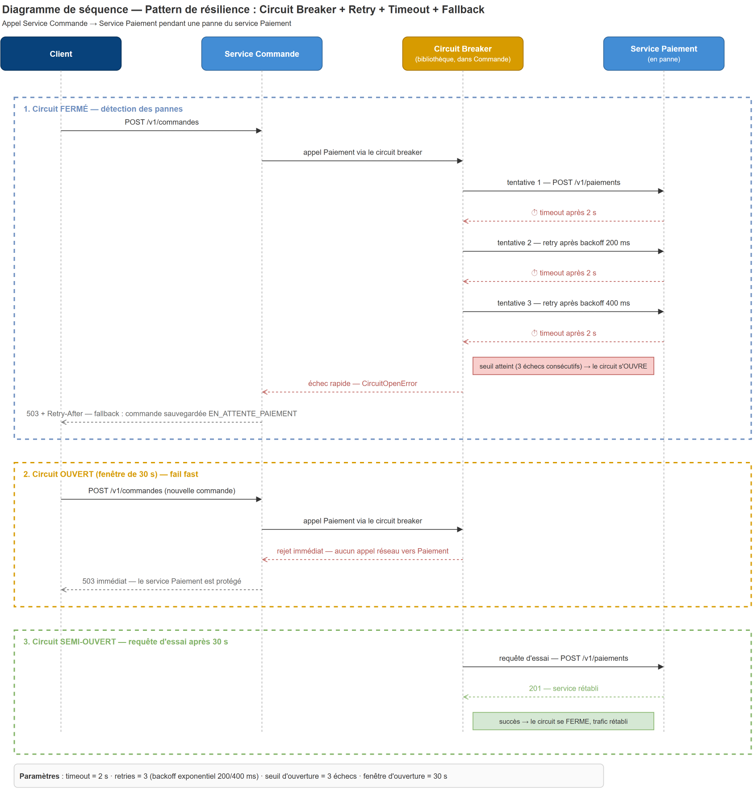

# 7. Résilience

## 7.1 Points de défaillance identifiés

| Point de défaillance                               | Impact sans protection                                                                                                        | Protection retenue                                                                                                               |
|----------------------------------------------------|-------------------------------------------------------------------------------------------------------------------------------|----------------------------------------------------------------------------------------------------------------------------------|
| **Service Paiement indisponible** (ou PSP lent)    | L'appel synchrone Commande→Paiement bloque des threads, les commandes s'empilent, la panne remonte en cascade jusqu'au client | **Timeout + Retry + Circuit Breaker + Fallback** (détaillé ci-dessous)                                                           |
| PSP externe en panne                               | Idem, vu du service Paiement                                                                                                  | Timeout + circuit breaker dans Paiement vers le PSP                                                                              |
| Service Restaurant ne répond pas au catalogue      | Recherche indisponible                                                                                                        | Découplage : le Catalogue est un read model autonome + **fallback cache Redis** (résultats servis même périmés, marqués `stale`) |
| RabbitMQ indisponible                              | Événements perdus, SAGA gelée                                                                                                 | Transactional Outbox (rien n'est perdu, publication différée) + files durables ; la SAGA reprend au redémarrage                  |
| Restaurant/Livreur ne répond jamais (délai humain) | Commande bloquée indéfiniment                                                                                                 | **Timeouts métier** de la SAGA (5 min acceptation, 10 min affectation) → compensation automatique                                |
| Crash d'un service en cours de SAGA                | État incohérent                                                                                                               | État persistant `saga_state` + messages idempotents : reprise là où on s'était arrêté                                            |

## 7.2 Pattern principal : Circuit Breaker sur Commande → Paiement

L'appel **synchrone** le plus critique du système est l'autorisation de paiement pendant le passage de commande. Nous le protégeons par la combinaison de quatre patterns (implémentation Python : bibliothèques `tenacity` pour retry/backoff et un circuit breaker type `pybreaker`, ou resilience intégrée de `httpx`) :

### 1. Timeout — ne jamais attendre indéfiniment

Toute requête HTTP sortante a un timeout de **2 s** (connexion + lecture). Un service lent est traité comme un service en panne : on libère la ressource et on décide.

### 2. Retry avec backoff exponentiel — absorber les pannes transitoires

En cas d'échec (timeout, 5xx, erreur réseau) : **3 tentatives** maximum, espacées de 200 ms puis 400 ms (+ jitter aléatoire pour éviter les rafales synchronisées). Uniquement sur des opérations **idempotentes** : l'autorisation porte une **clé d'idempotence** (`Idempotency-Key: <order_id>`) afin qu'un retry ne débite jamais deux fois.

### 3. Circuit Breaker — arrêter de frapper un service à terre

- **FERMÉ** (nominal) : les appels passent ; on compte les échecs.
- **OUVERT** : déclenché après **3 échecs consécutifs** (tentatives épuisées). Pendant **30 s**, tout appel échoue immédiatement (*fail fast*) sans toucher le réseau : le service Paiement peut récupérer au lieu d'être bombardé, et le service Commande répond vite au lieu d'accumuler des threads bloqués.
- **SEMI-OUVERT** : après 30 s, **une** requête d'essai passe. Succès → circuit refermé ; échec → réouverture pour 30 s.

### 4. Fallback — dégrader le service au lieu de le refuser

Quand le circuit est ouvert (ou les retries épuisés), le service Commande ne perd pas la commande :

- la commande est **sauvegardée** en état `EN_ATTENTE_PAIEMENT` (transaction locale) ;
- le client reçoit un **503 + Retry-After** avec un message explicite (« paiement momentanément indisponible, votre panier est conservé ») ;
- un job interne rejoue l'autorisation dès que le circuit se referme, ou la commande expire après 15 min.

Côté **Catalogue**, le fallback est différent : si MongoDB ou la projection sont indisponibles, les résultats sont servis depuis le **cache Redis** (donnée éventuellement périmée mais service maintenu — *graceful degradation*).

## 7.3 Paramètres récapitulatifs

| Paramètre | Valeur | Justification |
|-----------|--------|---------------|
| Timeout HTTP | 2 s | P99 attendu de l'autorisation < 800 ms ; 2 s laisse de la marge sans bloquer l'utilisateur |
| Tentatives | 3 | Couvre les pannes transitoires ; au-delà, la panne est durable |
| Backoff | 200 ms, 400 ms + jitter | Exponentiel : n'aggrave pas la congestion |
| Seuil d'ouverture | 3 échecs consécutifs | Réaction rapide sur le chemin critique |
| Fenêtre d'ouverture | 30 s | Temps réaliste de récupération d'un service (redémarrage de pod) |

## 7.4 Résilience complémentaire au niveau de l'architecture

- **Bulkhead implicite** : chaque service a son pool de connexions et ses ressources ; la saturation de l'un n'épuise pas les autres.
- **Asynchronisme comme amortisseur** : les étapes via RabbitMQ tolèrent nativement l'indisponibilité du consommateur (les messages attendent dans la file).
- **Dead Letter Queues** : messages toxiques isolés au lieu de bloquer les files.
- **Health checks** (`/health`) sur chaque service pour l'orchestrateur de conteneurs et le gateway.
